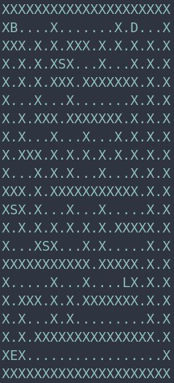

---
title: Computer Graphics - TSBK07 - Project report
author: Loïs Bilat, Felix Eklöf
date: \today
--- 

# Introduction

We wanted to create a game, and a maze seemed to be an idea that could be relatively easily achieved, while allowing us to add as many features as we wanted if we had enough time. So we decided to develop a 3D - first person maze game, where the maze itself is based on a 2D grid. In the original specification list, we planned to implement at least basic graphical functionalities as done in the labs (skybox, lightning, import OBJ files, textures). For the gameplay, we wanted collision with the walls, some score objects we could interact with, special graphics for the goal and we wanted to maze to be described in a text file, allowing us to maybe implement a random maze generator. We were thinking about making the maze dynamic, adding some sound effects and doing some drawing optimization, but this wasn't in our *Will do* list. 

In the end, we ended implementing all the functionalities described above, as well as a user interface, and some improvments to the lightning system compared to the one done in the labs.

In the end, we have the following functionalites : 

- Skybox
- Textured walls and floor and objects
- Collission detection between the camera / holy grail and the walls
- Simple geometry for objects, like boxes and spheres, abbility to interract with score objects, flag, ...
- First-person view 
- Light sources : one on player, score objects, levers and start/end, updates when objects in the maze change, optimized to only applied to close enough cells
- Spotlight source following the player
- Normal mapping for flat surfaces (walls, ground)
- Importing of OBJ objects
- Score objects, with UI indicator
- Dynamic maze (open / close some doors) when using the lever
- Maze descibed by a text file, stored as a 2D array. 
- Multi level management, with automatic level switching, correct positioning and direction of player on spawn
- We can pick the flag and take it with us, has an animation and collision with walls
- Special graphics for the goal: Gold coin fountain on the start cell when holding the cup, with the coins staying on the floor for a while
- UI : score, level, objective and interactive button indications shown.
- Sound effects : ambiant and interactions
- Drawing optimized : done using 2D frustum calling, and custom flood-bassed algorithm  
- Random generated maze : maze, start, end and door are generated, as well as lever and scores.

# Implementation details

The whole project was done in C, using the lab libraries (MicroGLut, GL_utilities, VectorUtils3, loadobj, loadTGA) as well as aditional ones from the course website (CallMeAL, simplefont).

When we started coding, we planned on writing all the code in two files : *main.c* and *utils.c*. We didn't planned for *utils.c* to become so big, and we should probably have organized our code differently, but it would have required too much changes to correct this, so we decided stay to keep it like that. Of course, we also have some code for the shaders : *project.frag and project.vert* for the majority of what we draw, and *sky.frag and sky.vert* specificaly for the skybox.

## main.c 

In this, we had the OpenGL initialization, and the main drawing loop. Our goal was to make this file as small a possible, and to do most of the work using functions defined in *utils.c*.

In the *init* function, we do the following actions :

- We initialize the CallMeAL and simplefont libraries
- We load all the models and textures, and bind them correctly to the texture units. For each texture that will be applied on a flat surface (walls, floor, ...), we have two textures (Albedo and normal map). This will be used in the shaders to create a better lighting effect. Each texture has its own texture units. Since we don't have to much textures, we can allow ourselves to use one unit for each texture. This will remove the need to change textures associated to each unit too many times. 
- We set a few default matrices (The camera matrix is initialized depending on the first level, the projection matrices are uploaded to th GPU, and the created some base position and rotation matricies for the maze "building blocs").

The *display* function is were all the interesting code of the main file can be found. It can be split into three parts :

- First, we upload some data to the GPU that will be needed later. We update the camera acording to the keyboard inputs, upload matrices for the skybox
- Then, we have to main drawing loop. We go through each cell of our maze to draw it. If the current cell is inside a wall, we simply ignore it. Otherwise, we start to draw all the elements one by one. We draw the floor, walls on the sides that require one, eventually doors, and then, once we have to maze structure drawn, we can draw some objects; levers to open the door, score objects and special goal graphics. For every cell, we simply need to look into the 2D maze array to see what we have to draw. For walls, we created functions such as *wall_north, wall_east*, to easily know if we have to draw walls on the side of the cell.
- The last section isn't necessary to the project, since it simply prints some statistics about the drawing optimisation we implemented. But we though it was nice to have it inside the game to be able to more easily understand and demonstrate was is happening. 

## utils.c

In this file, we implemented the biggest part of our code. From the camera update, to the object interaction, maze generation, sound and drawing optimiztation, we all put it in there. The most important function is *update*. The function is called from main.c in the display loop, and will handle the correct functionning of the game.

All the key actions will be handled here. We can exit the game, go to the next level, move the player and the camera, interact with the objects, and other. All the transformations done to the camera are done in this function, as well as the walking animation.

Following this, we have the function that make the interactions with the maze possible. *check_position* and *check_corner* implement collisions with the walls and check_flag, pickup_score, enable_lever and change_state_door allow the player to change the state of the game.

*reset_flood* and *flood_from_position* implement the drawing optimisation that looks at which cells might be visible from the current position. We then have a few utility functions, to reset the camera, load a level, ...

You can then find all the functions used to draw objects in the maze. There is one for each kind of object, as well as functions to upload the lights to th GPU and to draw the user interface.

To end this, we have function to simulate the particles, followed by the maze generation code and the frustum culling drawing optimization.

# Interessting problems

We will now focus on a a few interresting implementation details, mostly some that weren't really mentionned during the presentation. The presentation is available on the git repository if needed.

## Lightning

For our lightning, we used ambiant, diffuse and specular lighting. We also added attenuation and a spotlight effect, but the most interessting element in the normal mapping. We used a few tricks to make it easier to implement, and we will try to explain them. 

When looking at a normal map texture, we see that it's mostly blue, meaning that the normal vector are oriented to the *z* axis (Normal vector is $(R, G, B)$). This means that the normal map is made for a flat mesh, and that some special calculations are required to map it correctly to the in-game polygons. What we decided to do is to ignore this issue, and only apply normal mapping on flat surfaces. We created the model for a wall in the exact orientation that would correspond to the one in the normal map texture. That, way we could directly use the normal vectors, without transformation. Of course, when we rotate our wall model, wee also rotate the normal vectore, using adequate matrices. Ths trick allows us to use normal mapping in an easy way, but greatly reduces the possible use cases, since it only works on flat surfaces, but it is enough for our maze.

{#id .class width=24%} {#id .class width=24%} {#id .class width=24%} {#id .class width=24%}

The rest of the lightning system is quite easy. Attenuation is simply done by multiplying a pixel's light value with a number inversely proportional to the distance to the light source. The attenuation is different for the moving player's light and fixed lights. For the fixed light, the intensity rapidly decreases to zero. That way, the light won't be seen from behind a wall, removing some weird effects. For the player's light we don't have this issue, so the range of the light is higher.

The spotlight effect is done by calculating the angle between the light orientation (in our case the player orientation) and the vector from a pixel to the light source. If it is greater than 25°, we attenuate it in s miliar way as for the previously done attenuation. It is only applied to walls and the ground, and not the holy grail or other objects, making it more reallistic for when we carry the holy grail.

## Particle system

We decided to add a particle system for the goal to make it look nicer. The code is split in two main parts, the simulation and the drawing. To simulate, we need an array containing all the particles, and we need to instanciate all those particles. We will give each one of them a semi-random position, speed and orientation. The *y* position will be between *0* and *-1*, corresponding to up to one "wall-height" under the ground. This will allow us to create all the particles ar the same time, but still have them come out of the ground at a different time, giving this fountain effect. The *x* and *z* positions are centered around the middle of the cell, with a little displacement. The speed is, for the three axis, also random. We give a random orientation so not all the models are facing in the same direction. At each step of the iteration, we will add the speed values to the position values, and this for the three axis. We add a little bit of noise to the positions, to make them look less artificial. To simulate the gravity, we remove a constan value from the vertical speed at every step. 

We also wanted to give the effect that the particles stay on the ground. We first tried doing this by stoping the movement of the particles when they were on the ground, and generate new ones, but it quickly gave some performance issues. Instead, we only keep them for a little while, and then use them as "new" particles. Do do this, we check the distance from the particle to the ground, and if a particle is really close to the ground, we set it's horizontal speed to 0, and use a smaller gravity constant for the rest of the simulation. Once the particle reaches under the ground, we can reset it and give it new a original position. To draw them, we simply look into the particle array and call *draw_model* using some transformation matrices depending on the particle's position and orientation. 

To implement it, we decided to put the simulation in the CPU, instead of in the GPU. On the first look, it might be a bad idea if we want to have a lot of particles, but it actually doesn't matter in our case. The biggest problem when increasing the number of particles is actually the GPU. Indeed, each one of the particle is actually a complete 3d model, and putting 10'000 objects, each one with lighting computation is too much for a integerated GPU. If we would have wanted to have a huge number of particles, we would have had to change the design of them completly, so they would simply be triangles with no lighting. Only once this is done we can start increasing the number of particles and potentially move the simluation to the GPU to, this time, reduce the bottleneck from the CPU.

## Maze generation

In our game, we have the possibility to create our own levels by hand, allowing us to creating interessting and challenging puzzles. But at some point the player might run out of mazes, so the maze generator will continue providing some. It functions in multiple steps. The first thing to do is to create the empty maze, with only a start cell. For this, we took inspiration from some code written by [joewing on GitHub](https://github.com/joewing/maze). We wanted to focus more on generating the particularities of our maze, and not the basic maze creation itself. This used depth-first search, and always creates the start cell at the top-left corner.

For the following steps, two arrays are used. The first one is the maze itself, the other one is a copy of the maze that will be used to provisionally change values of cells, to make for instance our flood work.

To generate the end of the maze, a recusrive flood algorithm is used. It might not be optimal to have as many recursive calls, but and alternative algorithm as seen in class that iterativly flood a row, then recursivly spread to adgacent rows isn't very usefull because of the structure of the maze. Moreover, the maze isn't that big so it isn't such a problem. By keeping track of the recursion depth, we can know see what is the furthest cell from the start, and put the Holy Grail there.

To place a door, we solve the maze using again some code written by [joewing on GitHub](https://github.com/joewing/maze). We will then have a path from start to end, and we just have to move along it until we are at equi-distance from the start and end. The door will be placed here. Since the maze doesn't have loops, we will have to open the door if we want to get the Holy Grail.

Tu put the Door switch, we use the same recurisve - furthest-cell - flood algorithm to put the switch as far as possible from the door, to maximize playing time. In some mazes, this cell happens to be the start cell, in which case is is easier to completly regenrate the maze than trying to find an alternative position for the switch. 

Score objects are randomly placed, we since we wanted them to still be a little be hidden, we only accept dead-end cells. For this, we just try some random positions until we found valid ones.

You can see there a few examples of generated mazes :

{#id .class width=24%} {#id .class width=24%} {#id .class width=24%} {#id .class width=24%}

## Drawing optimization

The drawing optimization we applied might well be the hardest but useless thing we implemented. Our maze isn't big enough to really have any kind of performance issues, but we still decided to implement it to see how we could do it. We first though of doing a true frustum culling, but we realized quickly that it was going to be hard. So we compromized and went for a similar but less precise algorithm. The hardest thing was to find where were the borders of the frustum in the grid. We knew that the camera field of view was 90°, so we used this information to find some points on the border of the frustum. By moving by the size of the maze in the camera orientation, and then by the same distance on both the left and the right, we created a 90° cone. We now just needed to draw the actual frustum borders, and for that we used Bresnham's line drawing algorithm. We use the pseudo code found on [Wikipedia](https://en.wikipedia.org/wiki/Bresenham%27s_line_algorithm), and connected a the cell situated behing the player to the two previously found cells. All this was done in a special maze array with only walls on the side and only floor everwhere else. Since we moved by the size of the maze when finding the corner, the two corners are always outside of the maze, and this will create an area delimited on 2 sides by the frustum borders, and on two other sides by walls. We now simply have to flood this area, using a recursive agorithm. As explained with the maze generator, it might not be the optimal way to flood, but it worked well enough for our case.

After some "study" of our implemented drawing optimization, it seemed to work correctly, but it actually didn't really reduced that much the number of objects drawn. We still had the problem that everything behind walls was still drawn. We considered creating a ray-matching algorithm, but finally opted for another less precise method. 

We knew that, even if corridors inside the maze might be long, they are rarelly all the way a straight line. From this, we decided to create an algorithm that would flood from the player position up to a maximu distance equal to the side of the maze. This would guarantee that all the cells we might see are drawn, excepted in some extreme cases that in practice never happen. This only was already good, but we wanted to improve it further. We first forbid the flood algorithm to go further than one cell behind us (If we allowd zero cells, we could see that the cell behind us wasn't drawn we looking at our feet). This removed around half of the previously drawn cells. To improve it even further, we realized that we can't see anything that is after a 180° turn. We therefore adapted the algorithm to remember if which direction it previously had flooded, and forbade flood in opposite directions. With this algorithm in place, an avergage of only 15 cells were drawn at any time. compared to more than a hundred without any drawing optmization.

# Conclusion
We made several conclusions during and after the project. The first one was that it takes a long time to start with OpenGL. The runway time is really long, but when every thing is set up its easy to build on the foundation and keep adding elements. We also found that libraries were very useful for this project. Another conclusion we made was that a simple drawing optimization is easily implemented. However a more precis one takes more time to implement. We also realised that a drawing optimization used on a small map doesnt help that much with performance. Another lesson was that it is important to have the source code organized from the beginning. It is hard to fix that when you are a long way in to the project. Lastly we found that it was hard to find good models /texture pairs that are compatible with loadtga /loadmodel. We also realized that we could have spent more time looking for this. 
